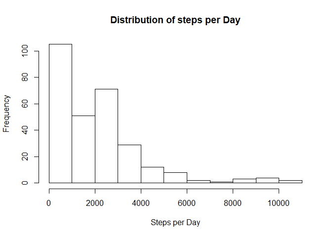
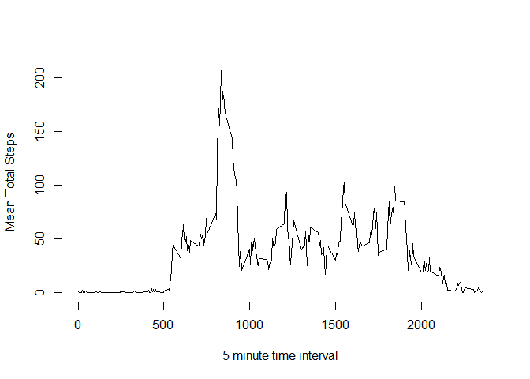
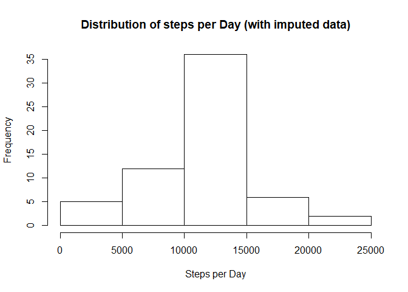

## Chris Thoburn 06-08-20

## Loading and preprocessing the data
Unzip and load the compressed zip file into dataset.  There are 3 columns of data (steps, date, interval)

```r
dataset <- read.csv(unzip("activity.zip"), 
                    header=T, 
                    colClasses = c(NA, "Date", NA))
```

## What is mean total number of steps taken per day?
While there are missing data, we can find the steps per day by excluding the NA entries.

```r
totalsteps <- tapply(dataset$steps,
                     dataset$interval,
                     sum,
                     na.rm = TRUE)

hist(totalsteps,
     main = "Distribution of steps per Day",
     xlab = "Steps per Day")
```

<!-- -->

```r
totalsteps_mean = mean(totalsteps)
totalsteps_median = median(totalsteps)
```
The histogram reveals a distribution that is skewed towards fewer steps per day.  
The Mean total steps per day is 1981.2777778.  
The Median total steps per day is 1808.  

## What is the average daily activity pattern?
To look at the average daily activity we can make a time series plot of the 5-minute interval and the average number of steps taken averaged across all days.


```r
intervalsteps <- tapply(dataset$steps,
                        dataset$interval,
                        mean,
                        na.rm = TRUE)

plot(names(intervalsteps),
     intervalsteps,
     type = "l",
     xlab = "5 minute time interval",
     ylab = "Mean Total Steps")
```

<!-- -->

```r
# get the first occurance of the maximum number of steps
intervalsteps_max <- names(intervalsteps[match(max(intervalsteps),
                                               intervalsteps)])
```

The maximum number of steps occurs in: 835.  

## Imputing missing values

```r
missingsteps <- nrow(dataset[is.na(dataset$steps) == TRUE, ])
```
There are 2304 NA entries for steps.

Because there mean total steps is very different depending on the time of day it may be more appropriate to impute based on the interval average rather than the daily average.

```r
# make a copy of the dataset in a new frame
imputeddata <- data.frame(dataset)

# loop over the intervals
for (interval in names(intervalsteps)) {
        # replace NAs with mean steps for the interval
        imputeddata[(is.na(dataset$steps) & dataset$interval == interval), 1] <- intervalsteps[interval]       
}
```
Now we can find the steps per day wiuth the imputed values.


```r
intervalimputed <- tapply(imputeddata$steps,
                          imputeddata$date,
                          sum)

hist(intervalimputed,
     main = "Distribution of steps per Day (with imputed data)",
     xlab = "Steps per Day")
```

<!-- -->

```r
totalimputedsteps_mean = mean(intervalimputed)
totalimputedsteps_median = median(intervalimputed)
```
Using the imputed data:  
The histogram reveals a distribution that is not skewed to lower step counts and appears more evenly distributed. 

The Mean total steps per day is 1.0766189\times 10^{4}.  
The Median total steps per day is 1.0766189\times 10^{4}.  

Imputing the missing data (by replacing the NAs with the mean steps for the intervals) resulted in a dataset that is more evenly distributed where the mean and medians are aligned.  This does result in higher mean and median values for the steps per day than the analysis that excluded the missing values.

## Are there differences in activity patterns between weekdays and weekends?


```r
library(lattice)

# add a factor based on weekdays
imputeddata[, "category"] <- as.factor(weekdays(imputeddata$date))

# condense this category factor to weekday or weekend
imputeddata$category <- as.factor(ifelse(imputeddata$category %in% c("Saturday", "Sunday"), "weekend", "weekday"))

# we need to calculate the interval means separated by this category
imputedsteps_category <- aggregate(steps ~ interval + category, data = imputeddata, FUN="mean")

# and graph by each category (weekend or weekday)
xyplot(steps ~ interval | category, data=imputedsteps_category, type="l", layout=(c(1, 2)), xlab="Interval", ylab="Number of steps")
```

<!-- -->

It would appear that ther are differences in the average number of steps for the time intervals split by weekend or weekday.  
The weekdays have more steps in the earlier intervals and fewer for many of the intervals in the middle of the day.  


